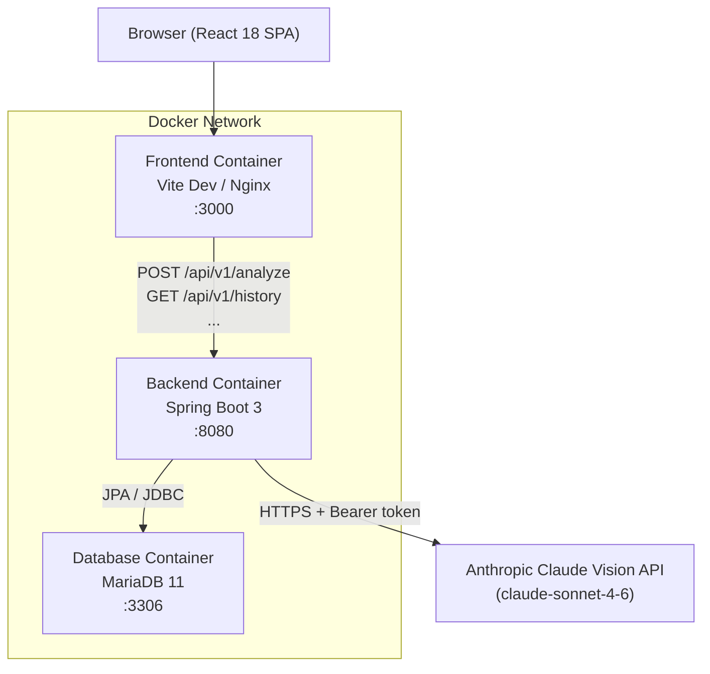
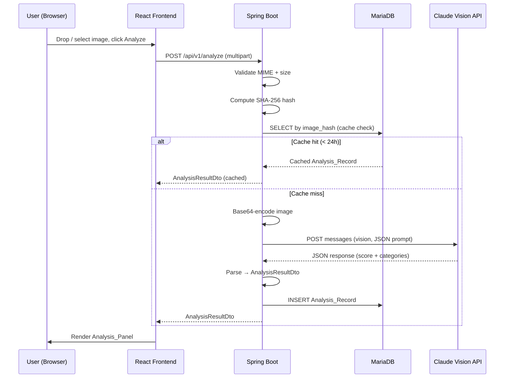

# Design Document — AI UI Review Agent

## Overview

The AI UI Review Agent is a full-stack web application composed of three independently containerized services: a React 18 single-page application (frontend), a Spring Boot 3 REST API (backend), and a MariaDB 11 relational database. Users upload UI screenshots through the browser; the backend validates, hashes, and forwards the image to Anthropic's Claude Vision API; structured feedback is returned, persisted, and rendered to the user. API keys never leave the server tier.

The design prioritizes:
- **Security**: API keys held only in the backend runtime; no client exposure.
- **Reliability**: Timeout + exponential backoff on the Claude API; structured error mapping.
- **Performance**: SHA-256 image-hash cache avoids redundant AI calls; indexed DB queries keep history P95 < 200ms.
- **Testability**: Property-based tests verify core parsing and validation invariants; JaCoCo enforces 80% backend coverage.

---

## Architecture



### Request Flow — Analysis



---

## Components and Interfaces

### Frontend Component Tree

```
App
├── Layout
│   ├── Navbar
│   └── Footer
├── HomePage
│   ├── HeroSection
│   ├── UploadZone
│   │   ├── DropArea          – drag-and-drop target, file input fallback
│   │   ├── ImagePreview      – FileReader-based inline preview
│   │   ├── FocusHintInput    – optional text field
│   │   └── AnalyzeButton     – disabled until valid file present
│   ├── AnalysisPanel
│   │   ├── ScoreRing         – circular SVG progress (Overall_Score)
│   │   ├── CategoryScoreBar  – horizontal bar per category
│   │   ├── SuggestionList
│   │   │   └── SuggestionCard – severity badge + title + desc + rec
│   │   └── ExportToolbar     – PDF export + copy-as-markdown
│   └── HistoryPanel
│       ├── HistoryItem       – thumbnail + timestamp + score + duration
│       └── ClearHistoryButton – triggers confirmation modal
└── ErrorBoundary
```

### Frontend State (Zustand store)

```typescript
interface AppState {
  // Upload
  selectedFile: File | null;
  previewUrl: string | null;
  focusHint: string;

  // Analysis
  analysisResult: AnalysisResultDto | null;
  isAnalyzing: boolean;
  analysisError: string | null;

  // History  (also mirrored in sessionStorage)
  history: HistoryEntry[];

  // Actions
  setFile(file: File | null): void;
  setFocusHint(hint: string): void;
  submitAnalysis(): Promise<void>;
  restoreFromHistory(entry: HistoryEntry): void;
  clearHistory(): void;
}
```

### Backend REST API Contract

| Method | Path | Description | Status codes |
|--------|------|-------------|--------------|
| POST | `/api/v1/analyze` | Upload + analyze image | 200, 400, 422, 429, 500, 503 |
| GET | `/api/v1/history` | Get session history | 200, 400 |
| GET | `/api/v1/analysis/{id}` | Get single record | 200, 404 |
| DELETE | `/api/v1/analysis/{id}` | Delete record | 204, 404 |
| GET | `/actuator/health` | Health check | 200, 503 |

#### POST /api/v1/analyze — Request

```
Content-Type: multipart/form-data

file        : binary (required)
focusHint   : string (optional, max 256 chars)
sessionId   : string (optional, max 64 chars)
```

#### POST /api/v1/analyze — Success Response (200)

```json
{
  "id": "550e8400-e29b-41d4-a716-446655440000",
  "sessionId": "abc123",
  "overallScore": 74,
  "processingMs": 3420,
  "cached": false,
  "categories": [
    {
      "name": "Layout",
      "score": 80,
      "weight": 0.20,
      "suggestions": [
        {
          "severity": "Warning",
          "title": "Inconsistent column widths",
          "description": "The sidebar column is 240px while the main content area varies between 800px and 920px across breakpoints.",
          "recommendation": "Use a 12-column CSS grid with fixed gutter widths to ensure consistent column sizing."
        }
      ]
    }
  ]
}
```

#### Error Response Format

```json
{
  "errorCode": "FILE_TOO_LARGE",
  "message": "Uploaded file size 11534336 bytes exceeds the 10MB limit.",
  "timestamp": "2024-01-15T10:30:00Z"
}
```

### Backend Spring Boot Service Map

```
AnalysisController
  → validates HTTP request shape
  → delegates to AnalysisService

AnalysisService
  → file validation (MIME, size, path traversal)
  → SHA-256 hash + cache lookup via AnalysisRepository
  → delegates to AnthropicClientService for AI call
  → parses response → AnalysisResultDto
  → persists via AnalysisRepository
  → returns AnalysisResultDto

AnthropicClientService
  → builds structured JSON prompt
  → Base64-encodes image
  → calls Claude Vision API (claude-sonnet-4-6) with 12s timeout
  → retries with exponential backoff on transient failures
  → returns raw JSON string

GlobalExceptionHandler
  → maps domain exceptions → HTTP responses
  → maps RateLimitExceededException → 429
  → maps InvalidFileTypeException → 400
  → maps FileTooLargeException → 400
  → maps AnalysisFailedException → 422
  → maps UpstreamApiException → 500
  → maps ServiceOverloadedException → 503
```

---

## Data Models

### Database Schema — `analysis_records`

```sql
CREATE TABLE analysis_records (
    id           VARCHAR(36)  NOT NULL PRIMARY KEY,        -- UUID v4
    session_id   VARCHAR(64)  NOT NULL,
    created_at   DATETIME     NOT NULL DEFAULT NOW(),
    overall_score TINYINT     NOT NULL,                    -- 0–100
    processing_ms INT         NOT NULL,
    image_hash   VARCHAR(64)  NULL,                        -- SHA-256 hex
    raw_response LONGTEXT     NOT NULL,
    focus_hint   VARCHAR(256) NULL,
    ip_address   VARCHAR(45)  NOT NULL,

    INDEX idx_session_id (session_id),
    INDEX idx_image_hash (image_hash)
);
```

### JPA Entity — `AnalysisRecord.java`

```java
@Entity
@Table(name = "analysis_records")
public class AnalysisRecord {
    @Id
    private String id;                  // UUID v4

    @Column(name = "session_id", nullable = false, length = 64)
    private String sessionId;

    @Column(name = "created_at", nullable = false)
    private LocalDateTime createdAt;

    @Column(name = "overall_score", nullable = false)
    private int overallScore;           // 0–100

    @Column(name = "processing_ms", nullable = false)
    private int processingMs;

    @Column(name = "image_hash", length = 64)
    private String imageHash;

    @Lob
    @Column(name = "raw_response", nullable = false)
    private String rawResponse;

    @Column(name = "focus_hint", length = 256)
    private String focusHint;

    @Column(name = "ip_address", nullable = false, length = 45)
    private String ipAddress;
}
```

### DTOs

```java
// Request
record AnalysisRequestDto(
    MultipartFile file,
    @Size(max = 256) String focusHint,
    @Size(max = 64)  String sessionId
) {}

// Response
record AnalysisResultDto(
    String id,
    String sessionId,
    int overallScore,
    int processingMs,
    boolean cached,
    List<CategoryDto> categories
) {}

record CategoryDto(
    String name,
    int score,
    double weight,
    List<SuggestionDto> suggestions
) {}

record SuggestionDto(
    String severity,       // "Critical" | "Warning" | "Suggestion"
    String title,
    String description,
    String recommendation
) {}

// History
record AnalysisSummaryDto(
    String id,
    String sessionId,
    LocalDateTime createdAt,
    int overallScore,
    int processingMs,
    String imageHash
) {}
```

### Frontend TypeScript Types

```typescript
interface AnalysisResultDto {
  id: string;
  sessionId: string;
  overallScore: number;         // 0–100
  processingMs: number;
  cached: boolean;
  categories: CategoryDto[];
}

interface CategoryDto {
  name: string;
  score: number;                // 0–100
  weight: number;               // 0.0–1.0
  suggestions: SuggestionDto[];
}

interface SuggestionDto {
  severity: 'Critical' | 'Warning' | 'Suggestion';
  title: string;
  description: string;
  recommendation: string;
}

interface HistoryEntry {
  id: string;
  thumbnailDataUrl: string;     // 128×128 data URL
  timestamp: string;            // ISO-8601
  overallScore: number;
  processingMs: number;
  result: AnalysisResultDto;
}
```

### Claude Vision Prompt Structure

The prompt is assembled by `AnthropicClientService` and sent as a `user` message with a `vision` content block:

```
You are an expert UI/UX designer and accessibility consultant. Analyze the provided UI screenshot and return ONLY valid JSON matching this exact schema:

{
  "overallScore": <integer 0-100>,
  "categories": [
    {
      "name": "<Layout|Typography|Color & Contrast|Accessibility|Consistency>",
      "score": <integer 0-100>,
      "suggestions": [
        {
          "severity": "<Critical|Warning|Suggestion>",
          "title": "<concise title>",
          "description": "<detailed description>",
          "recommendation": "<specific actionable recommendation>"
        }
      ]
    }
  ]
}

Evaluate exactly these five categories in order: Layout (weight 20%), Typography (weight 20%), Color & Contrast (weight 20%), Accessibility (weight 25%), Consistency (weight 15%).

[IF focusHint provided]: Focus particularly on: <focusHint>

Return ONLY the JSON object. No markdown fences, no prose.
```

---

## Correctness Properties

*A property is a characteristic or behavior that should hold true across all valid executions of a system — essentially, a formal statement about what the system should do. Properties serve as the bridge between human-readable specifications and machine-verifiable correctness guarantees.*

### Property 1: File Size Validation Rejects Boundary and Oversized Files

*For any* uploaded file whose size is greater than or equal to 10,485,760 bytes (10MB), the Analysis_Service SHALL reject the file with HTTP 400 and error code `FILE_TOO_LARGE`; and *for any* file whose size is strictly less than 10,485,760 bytes and greater than 0 bytes with a valid MIME type, the file SHALL pass size validation.

**Validates: Requirements 3.3**

---

### Property 2: MIME Type Validation Accepts Only Allowed Types

*For any* submitted file, the Analysis_Service SHALL accept it for processing if and only if its MIME type is one of `image/png`, `image/jpeg`, or `image/webp`; all other MIME types SHALL be rejected with HTTP 400 and error code `INVALID_FILE_TYPE`.

**Validates: Requirements 3.2, 10.1**

---

### Property 3: Overall Score Derivation Invariant

*For any* Analysis_Result_DTO, the `overallScore` field SHALL equal `round(layout * 0.20 + typography * 0.20 + colorContrast * 0.20 + accessibility * 0.25 + consistency * 0.15)` where each term is the corresponding category score (0–100); the computed overallScore SHALL always lie in the closed interval [0, 100].

**Validates: Requirements 4.4, 4.5**

---

### Property 4: JSON Response Round-Trip Consistency

*For any* valid raw JSON string returned by the Claude Vision API, parsing it into an `AnalysisResultDto` and then serializing that DTO back to JSON SHALL produce a JSON object that is semantically equivalent to the original (same field values, same structure, no data loss).

**Validates: Requirements 3.8, 4.1, 4.2, 4.3**

---

### Property 5: Cache Hit Idempotence

*For any* image submitted twice within a 24-hour window, the second call SHALL return an `AnalysisResultDto` with the same `id`, `overallScore`, and `categories` as the first call, and `cached` SHALL be `true` on the second call.

**Validates: Requirements 3.10**

---

### Property 6: History Limit Enforcement

*For any* sequence of n analyses in a session (n > 5), the History_Panel SHALL retain exactly the 5 most recent entries in both React state and sessionStorage; no entry older than the 5th-most-recent SHALL be present.

**Validates: Requirements 6.1**

---

### Property 7: Rate Limit Threshold Invariant

*For any* client IP address that submits exactly 10 requests within a 60-second window, all 10 requests SHALL succeed (HTTP 200); the 11th request within the same window SHALL be rejected with HTTP 429 and a `Retry-After` header.

**Validates: Requirements 8.1, 8.2, 8.4**

---

### Property 8: Suggestion Severity Membership

*For any* `SuggestionDto` in any parsed `AnalysisResultDto`, the `severity` field SHALL be one of the three enumerated values: `"Critical"`, `"Warning"`, or `"Suggestion"`; any response containing a suggestion with an unlisted severity value SHALL cause parsing to fail with `ANALYSIS_FAILED`.

**Validates: Requirements 4.3, 10.3**

---

### Property 9: History Session Isolation

*For any* two distinct session IDs, the analyses stored under one session SHALL NOT appear in the history results for the other session; session data SHALL remain isolated across concurrent users.

**Validates: Requirements 7.1, 7.2**

---

### Property 10: Export Markdown Completeness

*For any* `AnalysisResultDto`, the Markdown string produced by the Copy All action SHALL contain the overall score, all five category names, all category scores, and every suggestion title; no field present in the DTO SHALL be silently omitted from the export.

**Validates: Requirements 9.2**

---

## Error Handling

### Backend Exception Hierarchy

```
UIReviewException (base)
├── InvalidFileTypeException        → HTTP 400, INVALID_FILE_TYPE
├── FileTooLargeException           → HTTP 400, FILE_TOO_LARGE
├── PathTraversalException          → HTTP 400, INVALID_FILE_TYPE
├── AnalysisFailedException         → HTTP 422, ANALYSIS_FAILED
├── RateLimitExceededException      → HTTP 429, RATE_LIMIT_EXCEEDED
├── UpstreamApiException            → HTTP 500, UPSTREAM_API_ERROR
└── ServiceOverloadedException      → HTTP 503, SERVICE_OVERLOADED
```

### Retry Strategy (AnthropicClientService)

- Timeout per attempt: 12 seconds (configurable)
- Max retries: 3
- Backoff: 1s → 2s → 4s (exponential, no jitter for simplicity)
- Retry conditions: HTTP 429 (from Anthropic), HTTP 5xx, `SocketTimeoutException`, `ConnectException`
- Non-retryable: HTTP 400, HTTP 401 (configuration errors)

### Frontend Error Display

- Network errors and 4xx/5xx responses from the backend are caught by the Axios interceptor.
- The Zustand store sets `analysisError` with a human-readable message derived from the backend `errorCode`.
- The `UploadZone` component renders the error inline below the Analyze button.
- The `ErrorBoundary` component catches unexpected React render errors and displays a generic fallback UI.

---

## Testing Strategy

### Dual Testing Approach

The codebase uses both **unit / example-based tests** and **property-based tests** for complementary coverage:

| Layer | Tool | Min Coverage |
|-------|------|-------------|
| Backend unit + integration | JUnit 5 + JaCoCo | > 80% line |
| Frontend unit | Vitest | > 70% line |
| Frontend E2E | Playwright | Key user flows |
| Backend property | JUnit 5 + jqwik | Per property |

### Backend Unit Tests (JUnit 5)

- **AnalysisService**: file validation (MIME, size, empty, path traversal), hash computation, cache logic
- **AnthropicClientService**: prompt construction with and without focus hint, response parsing, retry exhaustion, timeout
- **RateLimitConfig**: bucket initialization from properties, request counting, reset after window
- **GlobalExceptionHandler**: all exception types mapped to correct HTTP status + error code

### Backend Integration Tests (Spring Boot Test + TestContainers)

- `POST /api/v1/analyze` — valid file, invalid MIME, oversized file, rate limit exceeded, Claude API mock failure
- `GET /api/v1/history` — with session ID, limit=0, limit=5, limit absent
- `GET /api/v1/analysis/{id}` — found and not-found cases
- `DELETE /api/v1/analysis/{id}` — success and not-found cases

### Backend Property-Based Tests (jqwik)

Each correctness property from the design maps to exactly one jqwik `@Property` test with minimum 100 tries:

- **Property 3**: Generate random category scores (0–100); verify weighted sum formula and range invariant.
- **Property 4**: Generate arbitrary valid JSON responses; verify round-trip parse→serialize equivalence.
- **Property 2**: Generate arbitrary MIME type strings; verify acceptance set is exactly {image/png, image/jpeg, image/webp}.
- **Property 1**: Generate file sizes at and around the 10MB boundary; verify reject-at-or-above, accept-below.

### Frontend Unit Tests (Vitest + Testing Library)

- **UploadZone**: drag-and-drop acceptance/rejection, file picker, size validation message, MIME validation message, button enable/disable state
- **AnalysisPanel**: renders score ring, category bars, suggestion cards with correct severity badge styles, collapsible sections
- **HistoryPanel**: sessionStorage round-trip, max-5 enforcement, restore on click, clear with confirmation
- **useStore**: state transitions for file selection, analysis submission, history management
- **exportUtils**: markdown generation completeness (Property 10 coverage)

### Frontend E2E Tests (Playwright)

- Happy path: upload PNG → loading indicator → full results render
- Export PDF download completes
- Copy as Markdown places text on clipboard
- History entry click restores panel
- Rate limit error message renders correctly

### Property Test Configuration

Each `@Property` test is annotated:
```
// Feature: ai-ui-review-agent, Property <N>: <property_text>
```
Minimum tries: 100 (jqwik default). Statistics logging enabled to track distribution coverage.
